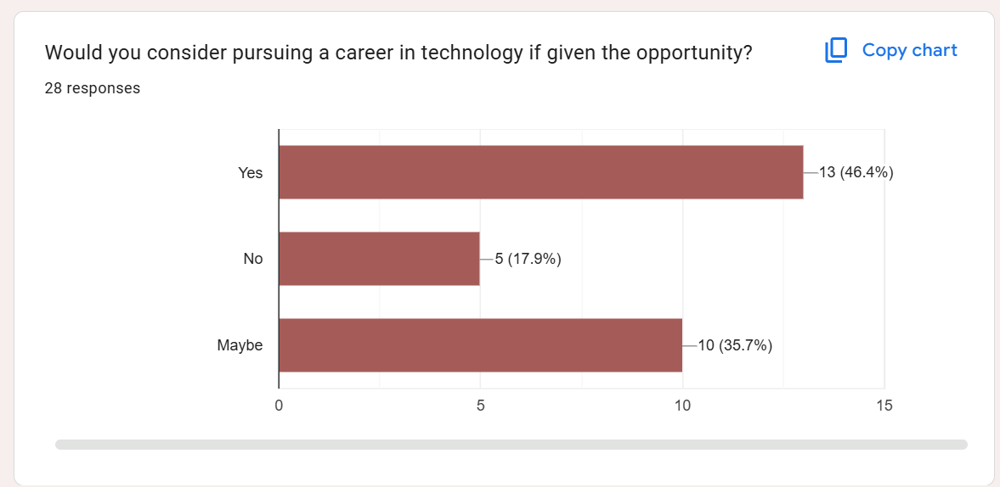

# Walkthrough: Milestone 7 Drug-Interaction Clinical Decision Support

## Overview

Milestone 7 introduces the backend foundation for explainable drug-interaction checking during dispensing.

The implementation adds a clinical rule catalogue, transaction-level clinical reviews, generated warning snapshots, warning acknowledgement, and integration with all three dispensing workflows:

- Direct Sale
- External Prescription
- Consultation

Milestone 7 is now complete. The models, migration, service layer, admin registration, dispensing integration, review UI, acknowledgement controls, completed-transaction history, and automated clinical tests are present and verified.

## Scope Implemented

The milestone currently checks medicine-to-medicine interaction rules only. Allergy and dosage alert types are reserved in the data model but are not evaluated yet.

The interaction check is local and deterministic. It does not call an external clinical API. A pharmacist or administrator first creates curated interaction rules in Django admin, including the explanation, recommendation, severity, and source reference.

## Clinical Data Model

The implementation in `clinical/models.py` adds three models.

### `DrugInteractionRule`



This is the curated source rule for a pair of medicines.

Stored fields:

```text
medicine_a
medicine_b
severity
description
explanation
recommendation
source_reference
is_active
created_at
updated_at
```

Supported severities are:

```text
LOW
MODERATE
HIGH
CRITICAL
```

Medicine pairs are canonicalized before saving. The medicine with the lower database ID is stored as `medicine_a`, and the higher ID is stored as `medicine_b`. This makes `Medicine A + Medicine B` equivalent to `Medicine B + Medicine A`.

The model also prevents:

- A medicine from interacting with itself.
- Duplicate rules for the same unordered medicine pair.
- Reversed duplicate pairs through a database check constraint and canonical ordering.
- Deleting a medicine that is referenced by a clinical rule, through `PROTECT` relationships.

Rules can be disabled with `is_active=False` without deleting their history.

### `ClinicalReview`

This records the latest clinical-check state for one dispensing transaction.

Stored fields:

```text
transaction
status
medicine_fingerprint
checked_pairs
checked_at
created_at
updated_at
```

There is one review per transaction. The supported statuses are:

```text
PASSED
WARNING
NOT_APPLICABLE
NOT_CHECKED
```

The medicine fingerprint is a sorted, comma-separated set of medicine IDs. It is used to determine whether a saved review still represents the current cart.

For example:

```text
Cart medicines: 9, 2, 9, 5
Fingerprint:     2,5,9
```

### `ClinicalAlert`

This stores an explainable warning generated for a transaction.

Stored information includes:

- Transaction and alert type.
- Severity and status.
- Both medicines involved.
- A short title and description.
- A detailed explanation.
- A recommended action.
- The clinical source reference.
- The rule that generated the alert.
- The user and time of acknowledgement.
- An optional acknowledgement note.

The alert copies the clinical text from the rule at check time. This gives the transaction a snapshot of the warning that was presented, even if the source rule is edited later.

The alert types currently defined are:

```text
DRUG_INTERACTION
ALLERGY
DOSAGE
```

Only `DRUG_INTERACTION` alerts are currently generated.

## Interaction-Checking Service

The main logic is in `clinical/services.py`.

### Creating a fingerprint

`medicine_fingerprint()` converts the supplied IDs to integers, removes duplicates, sorts them, and joins them into a stable string.

### Running the check

`check_drug_interactions()` runs inside a database transaction and performs the following steps:

1. Normalizes the medicine IDs and computes the fingerprint.
2. Creates or locks the transaction's `ClinicalReview` row.
3. Refuses to recalculate a transaction that is no longer in `DRAFT` status.
4. Deletes old generated alerts for the draft transaction.
5. Confirms that every cart medicine still exists.
6. Generates every unique medicine pair with `itertools.combinations`.
7. Loads active rules whose two medicines are in the cart.
8. Creates an explainable `ClinicalAlert` for every matching pair.
9. Updates the review status, fingerprint, checked-pair count, and check time.

The returned status is determined as follows:

| Situation | Status |
|---|---|
| A medicine ID cannot be resolved | `NOT_CHECKED` |
| The cart contains fewer than two distinct medicines | `NOT_APPLICABLE` |
| At least one active rule matches | `WARNING` |
| Pairs were checked and no rule matches | `PASSED` |

For `n` distinct medicines, the number of checked pairs is:

```text
n x (n - 1) / 2
```

### Detecting stale reviews

`current_review()` returns the saved review only when its fingerprint matches the current cart. A review for an older cart is therefore not presented as current.

### Invalidating a review

`invalidate_clinical_review()` resets the review and deletes its generated alerts. It is called when medicines are added to or removed from the cart.

### Acknowledging warnings

`acknowledge_alerts()` records:

- The authenticated user.
- The acknowledgement time.
- An optional note.

It updates all warning alerts for the transaction together.

## Dispensing Workflow Integration

The integration is implemented in `dispensing/views.py`.

### Cart context

`_clinical_context()` adds a current review and its alerts to the template context. Stale review data is hidden when the cart fingerprint has changed.

This context is added to:

- The Direct Sale cart.
- The External Prescription cart.
- The Consultation cart.

### Manual review endpoint

The following authenticated POST endpoint was added in `dispensing/urls.py`:

```text
/<transaction-id>/clinical-review/
```

`run_clinical_review()` limits access to the authenticated owner of a draft transaction, runs the interaction check against the current session cart, and displays a Django message for the resulting status.

### Cart changes

Adding or removing a medicine invalidates the previous review. External-prescription additions also invalidate the review. This prevents a check from remaining current after its medicine set changes.

Quantity changes do not affect the interaction fingerprint because this milestone evaluates medicine pairs, not dosage. Dosage checking is reserved for future work.

### Confirmation gate

Direct Sale, External Prescription, and Consultation confirmation now share `_confirm_after_clinical_review()`.

Before any stock is deducted, this helper:

1. Runs the interaction check again using the current cart.
2. Stops confirmation when the result is `NOT_CHECKED`.
3. Requires an `acknowledge_clinical_warnings` checkbox when warnings exist.
4. Records the warning acknowledgement and optional note.
5. Calls the existing atomic `confirm_transaction()` service only after the clinical gate passes.

This preserves the existing FEFO stock-allocation behavior. The clinical service does not deduct stock itself.

## Django Admin

The three clinical models are registered in `clinical/admin.py`.

### Interaction rules

Administrators can create and maintain rules, filter by severity or active status, and search by medicine, description, or source.

### Clinical reviews

Reviews are exposed as read-only operational records showing status, pair count, and check time.

### Clinical alerts

Generated alerts are fully read-only in admin. Manual addition, editing, and deletion are disabled so the audit snapshot cannot be changed through the admin interface.

## Security and Data-Integrity Controls

The current implementation includes the following safeguards:

- Clinical actions require authentication.
- A user can run a check or confirm only their own draft transaction.
- Checks and acknowledgement updates are atomic.
- The review row is locked during checking to reduce concurrent-update conflicts.
- Only active rules produce new alerts.
- Canonical medicine ordering prevents reversed duplicate rules.
- Confirmation reruns the check instead of trusting an earlier browser state.
- A failed clinical check stops confirmation before stock deduction.
- Generated alert text is retained as a transaction-specific explanation and audit record.

## Current User Journey

The intended completed journey is:

```text
Create draft transaction
        |
Add two or more medicines
        |
Run clinical review
        |
Passed --------> Confirm and dispense

Warning -------> Read explanation -> Acknowledge -> Confirm and dispense

Not checked ---> Stop; do not deduct stock
```

All three cart templates support this flow. They render the current review state, explainable alerts, an explicit POST review control, and warning acknowledgement fields. A cart change invalidates the old review and hides it until the current cart is reviewed again.

## Verification Performed

### Django system check

Command:

```powershell
.\.venv\Scripts\python.exe manage.py check
```

Result:

```text
System check identified no issues (0 silenced).
```

### Migration consistency check

Command:

```powershell
.\.venv\Scripts\python.exe manage.py makemigrations --check --dry-run
```

Result:

```text
No changes detected
```

### Migration

Generated and reviewed:

```text
clinical/migrations/0001_initial.py
```

Applied result on the configured database:

```text
Operations to perform:
  Apply all migrations: accounts, admin, auth, clinical, contenttypes,
  dispensing, inventory, medicines, sessions
Running migrations:
  No migrations to apply.
```

The configured database therefore already has `clinical.0001_initial` applied.

### Automated tests

The complete project suite passed in an isolated local test database:

```text
Found 82 test(s).
System check identified no issues (0 silenced).
Ran 82 tests in 2.902s
OK
```

The isolated verification settings used SQLite and Django's fast test password
hasher. The temporary settings file was removed after the run. The configured
remote PostgreSQL test database was not used for the final suite because setup
did not complete within the available timeout.

The suite covers the four severities, canonical rule validation, inactive and active rules, pair counts, multiple alerts, idempotent reruns, invalidation, acknowledgement auditing, all three dispensing workflows, stock safety, snapshots, authentication, and existing project regressions.

### Scenario verification

| Scenario | Expected behavior | Verification result |
|---|---|---|
| A - No Interaction | Two medicines with no matching active rule return `PASSED` | Passed |
| B - Warning | A synthetic matching rule returns `WARNING` and displays severity, explanation, recommendation, and source | Passed |
| C - One Medicine | One medicine returns `NOT_APPLICABLE` | Passed |
| D - Acknowledgement | Confirmation is blocked until warning acknowledgement; user and timestamp are stored | Passed |
| E - Cart Changed | Adding or removing a medicine invalidates the previous review and alerts | Passed |
| F - Historical Snapshot | Editing a rule later does not change the completed transaction's stored alert text | Passed |

## User Interface Completion

The completed UI provides:

- Accurate `PASSED`, `WARNING`, `NOT_APPLICABLE`, `NOT_CHECKED`, and `Not yet evaluated` states.
- A CSRF-protected Run Clinical Review button.
- Severity-distinct warning cards with the medicine pair, description, explanation, recommendation, and source.
- Required warning acknowledgement and an optional note in each confirmation form.
- Historical review, alert, and acknowledgement information on transaction details.
- A clear disclosure that consultation current medications are free text and are not included in structured matching.

All clinical rules used in tests are explicitly synthetic. No production clinical knowledge was generated or seeded.

## Final Status

Milestone 7 provides a complete structured and explainable drug-interaction workflow integrated into the dispensing confirmation path. It establishes the rule, review, alert, invalidation, acknowledgement, confirmation-gate, and historical-audit design without changing the existing FEFO stock-deduction service.

Milestone 7 is fully complete and verified. Allergy checking and dosage checking remain outside this milestone and were not implemented.
